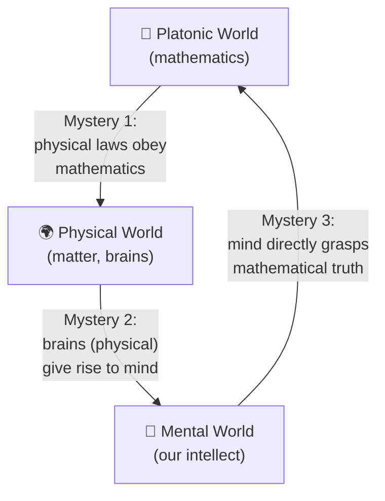
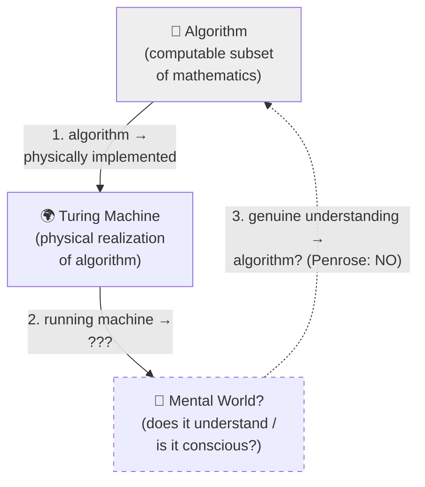

 # Mathematical Reality and Physical Reality

Penrose (in *The Emperor's New Mind*) describes three "worlds" — the Platonic
world of mathematics, the physical world, and the world of mind — linked by
three mysterious connections that form a closed loop, each smaller than the
one it emerges from:



### Plain-language version (ASCII)

```
        ┌───────────────────────────┐
        │   Platonic World          │
        │   (mathematics)           │
        └─────────────▲─────────────┘
                       │
   (3) mind grasps     │   (1) physical laws
   mathematical truth  │   obey mathematics
   directly (Gödel /   │   ("mysterious
   non-computability)  │   connection")
                       │
        ┌──────────────┴────────────┐
        │                           │
┌───────▼────────┐         ┌────────▼───────┐
│  Mental World   │◄────────│ Physical World │
│ (our intellect) │  (2)    │ (matter,       │
│                 │ brains  │  brains)       │
└─────────────────┘ give    └────────────────┘
                     rise
                     to mind
```

### The three mysteries

| # | Connection | Description |
|---|------------|--------------|
| 1 | Math → Physical | Physical reality appears to obey mathematical laws with uncanny precision — why should an abstract, timeless world govern a concrete, changing one? |
| 2 | Physical → Mental | Our brains are physical objects, yet they give rise to subjective experience and understanding. How does mind emerge from matter? |
| 3 | Mental → Math | Our minds can directly perceive mathematical truths (e.g., that a Gödel sentence is true) without merely computing them. Penrose argues this insight is *non-algorithmic*, which is central to his claim that consciousness cannot be pure computation. |

Penrose emphasizes that each world is in some sense smaller than, yet able to
"see," the one before it: only a small part of mathematics is realized
physically, only a small part of physical reality is alive/conscious, and
only a small part of mental activity grasps deep mathematical truth — yet the
loop closes back on itself, which is what makes the whole picture puzzling.

## The "algorithm" triangle — and why Penrose says it does NOT close

Algorithms are the *computable* subset of mathematics (Turing-machine
computable). A Turing machine is a physical (or physically realizable)
implementation of an algorithm. So it is natural to draw the same three-world
picture for computation:



### Where this differs from the mathematics triangle

| # | Connection | Human case (math triangle) | Machine case (algorithm triangle) |
|---|------------|------------------------------|-------------------------------------|
| 1 | World-of-truth → Physical | All of physical law obeys math (mystery, but accepted) | Algorithm is fully, mechanically realized by the Turing machine (no mystery — this is just engineering) |
| 2 | Physical → Mental | Brain (physical) gives rise to mind (deep mystery, but *presumed true* since we are conscious) | Running the machine → does it give rise to *any* mental/experiential state at all? Wide open / doubtful |
| 3 | Mental → World-of-truth | Human mind *directly sees* mathematical truth beyond any fixed algorithm (Gödel insight — non-algorithmic) | A machine's output is *by definition* algorithmic, so it can never do what step 3 requires — it cannot escape its own rule-set the way a mathematician can |

**Penrose's key move**: because algorithms are only a strict subset of
mathematics (Gödel's incompleteness shows every consistent formal system has
true statements it cannot prove/compute), a system whose behavior is *purely*
algorithmic (the Turing machine) can never reproduce arrow 3 — the
non-algorithmic insight that lets a mathematician "see" the truth of a Gödel
sentence for their own system. So he draws this triangle deliberately
**broken/dashed at step 3**: it illustrates *why he rejects strong AI* — a
Turing machine can sit inside the physical world and even simulate behavior,
but (he argues) it cannot close the loop back up to genuine mathematical
insight, and therefore (by his chain of reasoning) cannot be the whole story
of conscious understanding either.

So: your diagram is a good and faithful analogy of Penrose's structure — the
difference is that he presents it not as a working triangle like the
mathematics/physical/mental one, but as a **broken triangle**, and that
brokenness is itself his argument.
