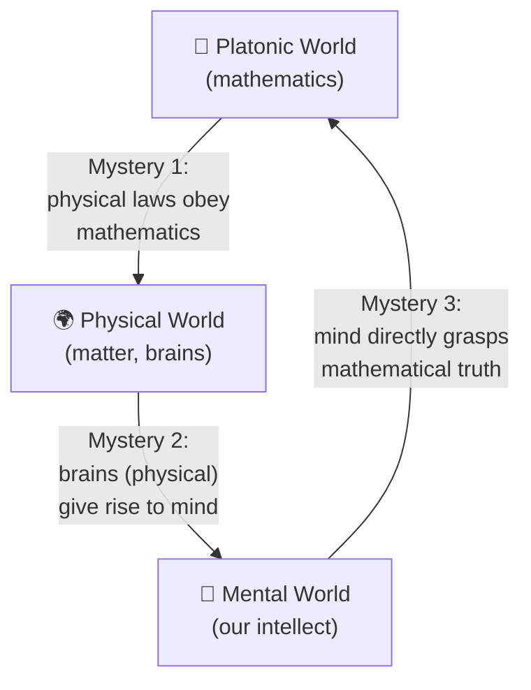

 # Mathematical Reality and Physical Reality

Penrose (in *The Emperor's New Mind*) describes three "worlds" — the Platonic
world of mathematics, the physical world, and the world of mind — linked by
three mysterious connections that form a closed loop, each smaller than the
one it emerges from:



### Plain-language version (ASCII)

```
        ┌───────────────────────────┐
        │   Platonic World          │
        │   (mathematics)           │
        └─────────────▲─────────────┘
                       │
   (3) mind grasps     │   (1) physical laws
   mathematical truth  │   obey mathematics
   directly (Gödel /   │   ("mysterious
   non-computability)  │   connection")
                       │
        ┌──────────────┴────────────┐
        │                           │
┌───────▼────────┐         ┌────────▼───────┐
│  Mental World   │◄────────│ Physical World │
│ (our intellect) │  (2)    │ (matter,       │
│                 │ brains  │  brains)       │
└─────────────────┘ give    └────────────────┘
                     rise
                     to mind
```

### The three mysteries

| # | Connection | Description |
|---|------------|--------------|
| 1 | Math → Physical | Physical reality appears to obey mathematical laws with uncanny precision — why should an abstract, timeless world govern a concrete, changing one? |
| 2 | Physical → Mental | Our brains are physical objects, yet they give rise to subjective experience and understanding. How does mind emerge from matter? |
| 3 | Mental → Math | Our minds can directly perceive mathematical truths (e.g., that a Gödel sentence is true) without merely computing them. Penrose argues this insight is *non-algorithmic*, which is central to his claim that consciousness cannot be pure computation. |

Penrose emphasizes that each world is in some sense smaller than, yet able to
"see," the one before it: only a small part of mathematics is realized
physically, only a small part of physical reality is alive/conscious, and
only a small part of mental activity grasps deep mathematical truth — yet the
loop closes back on itself, which is what makes the whole picture puzzling.
